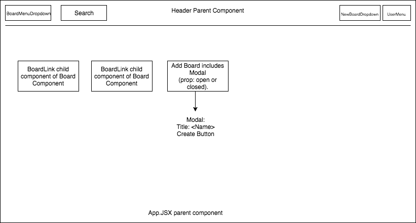
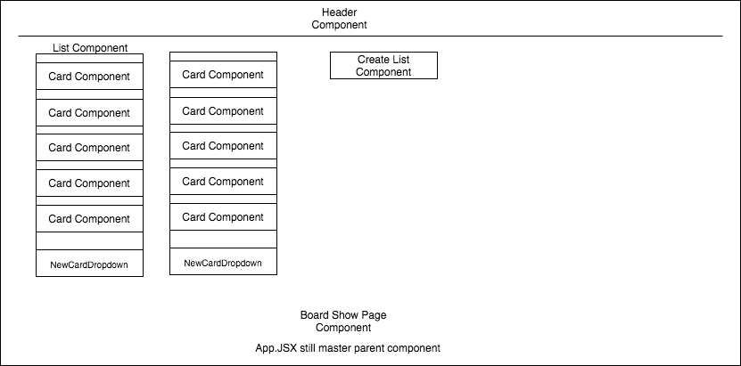

# Mello Production Readme

# Mello

[Mello Live Site][heroku]

[heroku]: http://www.melloboard.herokuapp.com

Mello is a superfast Trello-inspired note-taking application built on ReactJS + Rails.


## Features & Implementation

### Boards, Lists, and Cards

  Users have boards, which can be shared to many users.  Boards components contain list components, which contain card components, which themselves contain card modal components.  Cards can be moved among lists.  





### Notebooks

Implementing Notebooks started with a notebook table in the database.  The `Notebook` table contains two columns: `title` and `id`.  Additionally, a `notebook_id` column was added to the `Note` table.  

The React component structure for notebooks mirrored that of notes: the `NotebookIndex` component renders a list of `CondensedNotebook`s as subcomponents, along with one `ExpandedNotebook`, kept track of by `NotebookStore.selectedNotebook()`.  

`NotebookIndex` render method:

```javascript
render: function () {
  return ({this.state.notebooks.map(function (notebook) {
    return <CondensedNotebook notebook={notebook} />
  }
  <ExpandedNotebook notebook={this.state.selectedNotebook} />)
}
```

### Board Sharing

As with notebooks, tags are stored in the database through a `tag` table and a join table.  The `tag` table contains the columns `id` and `tag_name`.  The `tagged_notes` table is the associated join table, which contains three columns: `id`, `tag_id`, and `note_id`.  

Tags are maintained on the frontend in the `TagStore`.  Because creating, editing, and destroying notes can potentially affect `Tag` objects, the `NoteIndex` and the `NotebookIndex` both listen to the `TagStore`.  It was not necessary to create a `Tag` component, as tags are simply rendered as part of the individual `Note` components.  


## Future Directions for the Project

In addition to the features already implemented, I plan to continue work on this project.  The next steps for Mello are outlined below.

### Search

Searching notes is a standard feature of Mello.  I plan to utilize the Fuse.js library to create a fuzzy search of lists and cards.
