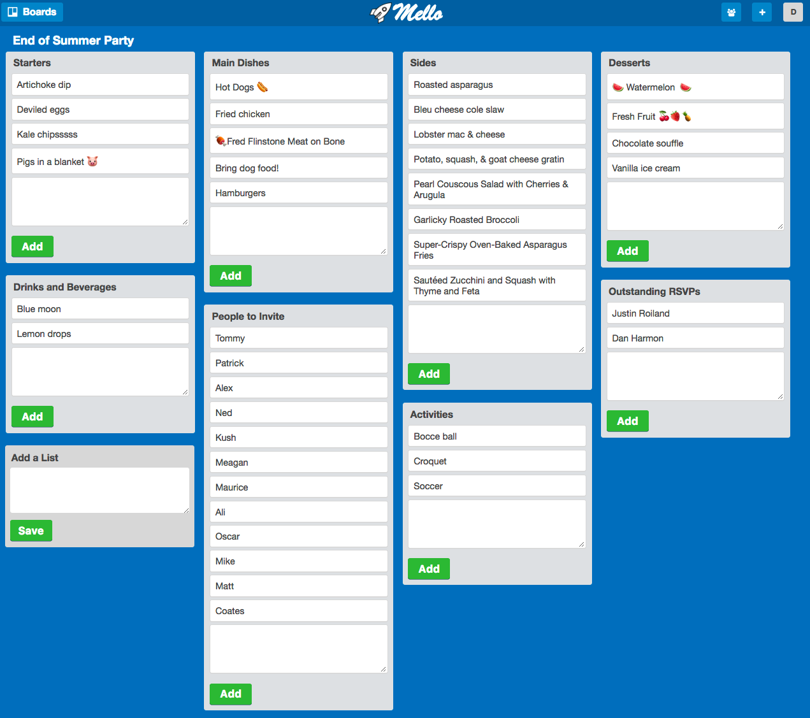

# Mello Production Readme

# Mello

[Mello Live Site][heroku]

[heroku]: https://melloboard.herokuapp.com

Mello is a superfast Trello-inspired note-taking application built on ReactJS + Rails and follows a Redux/Flux pattern.  Mello shines in showing off the incredible performance benefits of ReactJS and the huge benefits of organizing with React components.

Additionally, drag and drop is a notoriously difficult front-end problem to get right from a user-experience perspective, and one that I've wanted to work on for a long time.


## Features & Implementation

### Lightning-fast

Mello is substantially faster than other Kanban-style/Trello-style boards.  

Trello -- roughly 1000ms JS response time.


Mello -- roughly 100ms JS response time.  10x faster!


### Boards

  Users have boards, which can be shared to many users.  The board page navigation is always achievable through the menu bar on the left.


### Lists and Cards

Boards components contain list components, which contain card components, which themselves contain card modal components.  Cards can be moved among lists.




### Drag and Drop

Implementing drag & drop uses the ReactDnD library for mouse positioning and drag-detection only. All other logic, such as list ordering, event handling, and back-end updates were written natively.

Drag & drop is mostly cleanly implemented by having the back-end drive the front-end view, with the front-end passively listening for a JSON response object to render.  This reduces the possibility of front-end state becoming out-of-sync.


### Board Sharing

Board sharing is achieved through a join table, `board_shares`, and the JSON response is provided through the BoardIndex routes.

```ruby

@boards = current_user.boards.includes(:lists)
@shared_boards = current_user.shared_boards.includes(:lists)

...

json.set! :boards do
  @boards.each do |board|
    json.set! board.id do
      json.author_id board.author_id
      json.title board.title
      json.listIds board.lists.map{|el| el.id}
    end
  end
end
json.set! :shared_boards do
  @shared_boards.each do |board|
    json.set! board.id do
      json.author_id board.author_id
      json.title board.title
      json.listIds board.lists.map{|el| el.id}
    end
  end
end

```

## Future Directions for the Project

In addition to the features already implemented, I plan to continue work on this project.  The next steps for Mello are outlined below.

### Search

I plan to implement fuzzy searching across shared boards, lists, and cards using Fuse.js.

### Async Drag & Drop
Drag and drop is best executed asynchronously for ideal user experience.  A back-end-driven response cycle will create perceived latency.  In the future, I plan to execute front-end JS animations while asynchronously executing back-end updates, to create the perception of instantaneous drag-and-drop.
